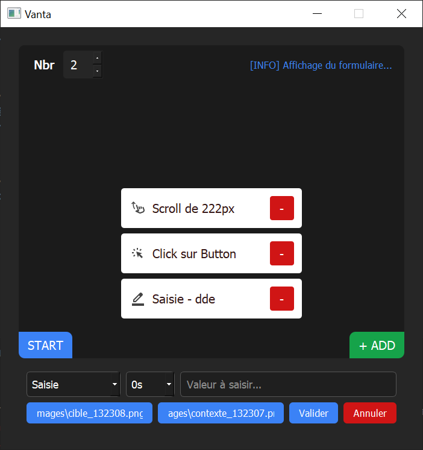
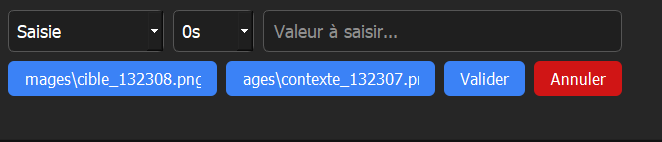
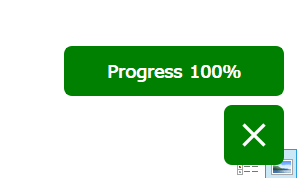

# 🧠 VANTA – Automatisation d'actions graphiques

> *Contrôlez l’incontrôlable. Automatisez tout ce qui peut l’être.*

---

## 📌 Présentation

**Vanta** est une application PyQt5 conçue pour automatiser des tâches graphiques sur Windows. Elle permet d’enchaîner des actions comme des **clics**, **saisies** ou **scrolls**, en se basant sur des **zones visuelles spécifiques** de l’écran.

L’objectif : gagner du temps sur les tâches répétitives, tester des interfaces ou simuler des comportements humains.

---

## 🚀 Fonctionnalités principales

* 🎯 **Ajout d’actions personnalisées**

  * Click, Saisie, Scroll (à venir ?)
  * Délai paramétrable
  * Zone cible + Contexte visuel

* 🖼️ **Capture d’écran intégrée**

  * Pour repérer précisément l’endroit où appliquer l’action

* 🔃 **Séquences réutilisables**

  * Actions stockées dans `actions.json` automatiquement

* 🧭 **Interface fluide et intuitive**

  * Ajout / suppression en quelques clics

* ⏱️ **Exécution répétée avec contrôle**

  * Définissez le nombre de boucles
  * Suivi en direct via une **fenêtre flottante**

* 🛑 **Arrêt d'urgence**

  * Arrêtez l’automatisation à tout moment avec le bouton dédié

* 📄 **Logs en console**

  * Affichage des étapes, erreurs ou interruptions

---

## 🖥️ Aperçu visuel

| Écran principal         | Ajout d'action             | Exécution en cours              |
| ----------------------- | -------------------------- | ------------------------------- |
|     |         |         |

---

## 🧩 Structure du projet

```
vanta/
├── icons/               # Dossier des icônes SVG
├── images/      
├── app.py               # Interface PyQt5
├── automate.py          # Boucle d'exécution des actions
├── capture.py           # Système de capture de zones
├── actions.json         # Stockage des actions enregistrées       
├── requirements.txt
└── README.md
```

---

## ⚙️ Installation

1. Clone le repo :

```bash
git clone https://github.com/arthursongwa/vanta.git
cd vanta
```

2. Installe les dépendances :

```bash
pip install -r requirements.txt
```

---

## 🧪 Utilisation

### 1. Lancer l’application

```bash
python app.py
```

### 2. Ajouter une action

* Clique sur **`+ ADD`**
* Sélectionne :

  * `Click` → pas de texte nécessaire
  * `Saisie` → entre le texte à écrire
* Choisis le délai entre les actions (ex. : 1s, 2s)
* Clique sur `Cible` pour capturer la zone de clic
* Clique sur `Contexte` pour capturer l'environnement autour
* Valide

### 3. Lancer l’exécution

* Sélectionne le nombre de répétitions
* Clique sur **`START`**
* Une fenêtre flottante s’ouvre avec la progression

### 4. Arrêter à tout moment

* Clique sur le bouton rouge dans la fenêtre flottante pour stopper

---

## 🛠️ Personnalisation

* Les **icônes** doivent être dans le dossier `icons/`
* Pour changer l’apparence : édite les styles dans `app.py` (CSS inline)

---

## ❗ Avertissement

> Cette application simule des actions humaines sur votre ordinateur.
> **N'utilisez Vanta que sur des interfaces que vous êtes autorisé à manipuler.**

---

## ❓ FAQ

### Comment savoir si une action a été bien ajoutée ?

Elle apparaît immédiatement dans la liste centrale avec son type et un bouton de suppression.

### Pourquoi utiliser "Contexte" en plus de "Cible" ?

Le contexte aide à **fiabiliser la reconnaissance d'image** quand la cible est petite ou changeante.

### Peut-on modifier une action après l’avoir ajoutée ?

Pas pour l’instant. Supprimez-la et recréez-la.

### Comment arrêter une exécution en cours ?

Cliquez sur le bouton rouge de la fenêtre flottante.

---

## 👤 Auteur

**Arthur Songwa-Nkuiga**

> [arthursongwa@gmail.com](mailto:arthursongwa@gmail.com)